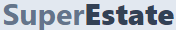

<!-- Improved compatibility of back to top link: See: https://github.com/othneildrew/Best-README-Template/pull/73 -->

<!--
*** Thanks for checking out the Best-README-Template. If you have a suggestion
*** that would make this better, please fork the repo and create a pull request
*** or simply open an issue with the tag "enhancement".
*** Don't forget to give the project a star!
*** Thanks again! Now go create something AMAZING! :D
-->

<!-- PROJECT SHIELDS -->
<!--
*** I'm using markdown "reference style" links for readability.
*** Reference links are enclosed in brackets [ ] instead of parentheses ( ).
*** See the bottom of this document for the declaration of the reference variables
*** for contributors-url, forks-url, etc. This is an optional, concise syntax you may use.
*** https://www.markdownguide.org/basic-syntax/#reference-style-links
-->

<!-- PROJECT LOGO -->
 

  

<h3 align="center">Super Estate</h3>

  

    Real estate rental platform
     
     
    <a href="https://super-estate-client.vercel.app/">View Demo</a>
  

<!-- TABLE OF CONTENTS -->

  
Table of Contents

  <ol>
    <li>
      <a href="#about-the-project">About The Project</a>
      <ul>
        <li><a href="#built-with">Built With</a></li>
      </ul>
    </li>
    <li><a href="#contact">Contact</a></li>
  </ol>

<!-- ABOUT THE PROJECT -->

## About The Project
![Product Name Screen Shot][product-screenshot]

Welcome to Super Estate, the premier real estate rental platform designed to make your property search seamless and efficient. Our platform leverages the powerful MERN stack (MongoDB, Express.js, React.js, and Node.js) to provide a robust, user-friendly experience for both renters and property owners.

(<a href="#readme-top">back to top</a>)

### Built With

- [![React][React.js]][React-url]
- [![TypeScript][TypeScript]][TypeScript-url]
- [![Tailwind][Tailwind]][Tailwind-url]
- [![Redux][Redux]][Redux-url]
- [![Express][Express]][Express-url]
- [![MongoDB][MongoDB]][MongoDB-url]
- [![Mongoose][Mongoose]][Mongoose-url]

(<a href="#readme-top">back to top</a>)

<!-- CONTACT -->

## Contact

Project Link: [https://github.com/ivanbutakov0/u-future](https://github.com/ivanbutakov0/super_estate)

(<a href="#readme-top">back to top</a>)

<!-- MARKDOWN LINKS & IMAGES -->
<!-- https://www.markdownguide.org/basic-syntax/#reference-style-links -->

[product-screenshot]: client/public/preview.png
[React.js]: https://img.shields.io/badge/React-20232A?style=for-the-badge&logo=react&logoColor=61DAFB
[React-url]: https://reactjs.org/
[TypeScript]: https://img.shields.io/badge/TypeScript-20232A?style=for-the-badge&logo=typescript&logoColor=1573c0
[TypeScript-url]: https://www.typescriptlang.org/
[Tailwind]: https://img.shields.io/badge/Tailwind-000?style=for-the-badge&logo=tailwindcss&link=https://tailwindcss.com/
[Tailwind-url]: https://tailwindcss.com/
[Redux]: https://img.shields.io/badge/Redux-20232A?style=for-the-badge&logo=redux&logoColor=7248b6
[Redux-url]: https://redux.js.org/
[Express]: https://img.shields.io/badge/Express-20232A?style=for-the-badge&logo=express&logoColor=f3f3f3
[Express-url]: https://expressjs.com/
[MongoDB]: https://img.shields.io/badge/MongoDB-20232A?style=for-the-badge&logo=mongodb&logoColor=00e963
[MongoDB-url]: https://www.mongodb.com/
[Mongoose]: https://img.shields.io/badge/Mongoose-20232A?style=for-the-badge&logo=mongoose&logoColor=8c080a
[Mongoose-url]: https://mongoosejs.com/
